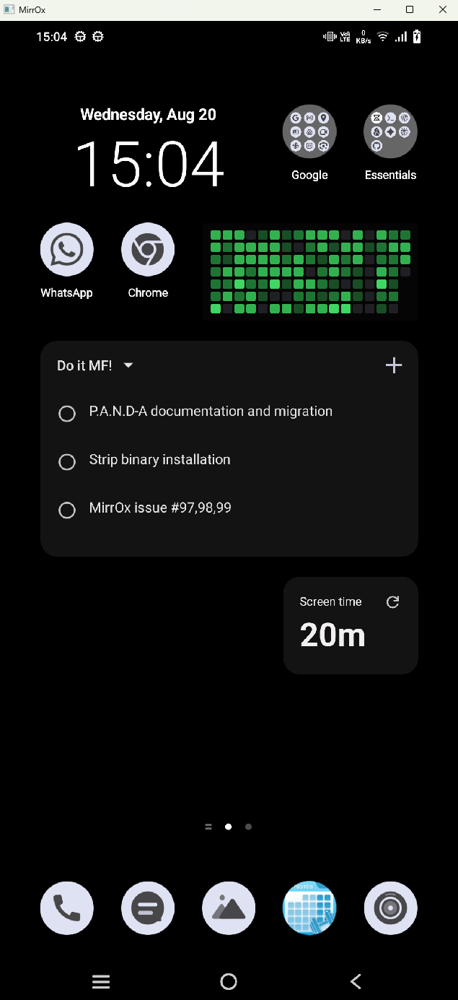

# MirrOx (Mirror + Oxidation)

**MirrOx** is a fast, minimal, Rust-powered Android screen mirroring tool — built from the ground up in pure Rust. 
No bloated UIs. 
No Java. 
Just lightning-fast screen capture via ADB, streamed over WebSocket, and rendered with SDL2.

My journey in building this has been preposterously [documented](https://github.com/IDKSAM27/MirrOx/tree/main/doc_stuff). You can check it out if you have strong guts. (^_~)


## Features

- Real-time Android screen mirroring (via ADB)
- WebSocket support for future remote viewing/control
- SDL2 window rendering
- Device battery + uptime info
- Cross-platform Rust CLI with GUI


## Preview

> _Imagine your Android screen, live in an SDL2 window — and streamed over WebSocket... in Rust._

> #TODO _(Add a GIF or screenshot here if possible!)_



## Requirements

- [Rust](https://www.rust-lang.org/tools/install)
- [ADB](https://developer.android.com/tools/adb) (Android Debug Bridge) installed and accessible in your PATH
- A connected Android device with **USB debugging enabled** and **Allow this computer** option enabled (asks only the first time)
- [SDL2](https://www.libsdl.org/) development libraries installed (for native builds)


## Pre-built Binaries

- Find the latest builds under [Releases]()
- Just download the binary for your OS and run it.


## Installation

Clone the repo:

```bash
git clone https://github.com/IDKSAM27/MirrOx.git
cd MirrOx/mirrox
```


Build it:
```bash
cargo build --release
```

Run it:
```bash
cargo run --release
```


## How It Works

- Captures screen using adb exec-out screencap -p

- Sends frames over a broadcast channel

- GUI (SDL2) and WebSocket stream subscribers receive frames

- You see your Android screen — live!


## Developer Notes

`video.rs`: Handles screen capture and broadcasting

`gui.rs`: SDL2 rendering and window management

`network.rs`: WebSocket server for streaming

`adb.rs`: ADB interaction layer

`main.rs`: Entry point and async task orchestration


## Why "MirrOx"?

Because it’s a mirror... with a bit of Rusty OX-ness 🐂

> Also.. it sounds cool.


## Contributing

- Pull requests, issues, and feature requests are welcome!

- If you're a Rustacean (or aspiring one), this is a great playground.


## License

> [MIT License](https://github.com/IDKSAM27/MirrOx/blob/main/LICENSE).

Do whatever you want. Just don’t blame me if your cat deletes your phone.

## Credits

Inspired by scrcpy

> Built with ❤️ in Rust

---
---

#### Quick guide chart (for developers)
```graphql
MirrOx/
│── mirrox/  
│    │── src/  
│    │   ├── main.rs               # Entry point  
│    │   ├── adb.rs                # ADB communication  
│    │   ├── usb.rs                # USB handling  
│    │   ├── network.rs            # TCP/IP communication  
│    │   ├── video.rs              # Video decoding & rendering  
│    │   ├── input.rs              # Keyboard & mouse input handling  
│    │   ├── recorder.rs           # Screen recording support  
│    │   ├── config.rs             # Configuration settings  
│    │   └── utils.rs              # Helper functions  
│    │── Cargo.toml                # Dependencies & metadata  
│    │── README.md                 # Documentation  
│
│
│── Experimental MirrOx (not in the release, Welcomed by fellow contributors)

```
